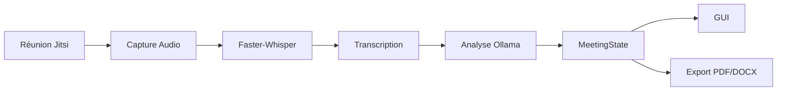

# Référence de Développement

## Vue d'ensemble

Le projet **Meeting Assistant** est une plateforme locale de génération automatique de comptes rendus de réunion à partir de réunions Jitsi.

Le pipeline principal est :

```text
Jitsi → Audio → Transcription → Analyse LLM → MeetingState → GUI / Export
```

L'objectif architectural est de maintenir une séparation claire entre :

- la capture des données ;
- leur traitement ;
- leur analyse ;
- leur restitution.

---

# Stack Technique

| Couche | Technologie |
|----------|-------------|
| Interface graphique | PySide6 |
| Automatisation navigateur | Playwright |
| Réunions | Jitsi Meet (self-hosted) |
| Transport audio | WebSocket PCM |
| Transcription | Faster-Whisper |
| Analyse | Ollama (`qwen3:4b`) |
| Export | PDF / DOCX |
| Langage | Python 3 |

---

# Architecture d'Exécution

```text
Jitsi (192.168.10.151:8443)
              │
              ▼
      Jitsi Bot
      (Playwright)
              │
              ▼
   Client Web Local
    (127.0.0.1:8000)
              │
              ▼
      PCM Server
    (127.0.0.1:8765)
              │
              ▼
     Faster-Whisper
              │
              ▼
   live_transcript.txt
              │
              ▼
          Ollama
        (qwen3:4b)
              │
              ▼
   meeting_state.json
              │
      ┌───────┴───────┐
      ▼               ▼
     GUI         PDF/DOCX
```

---

# Composants Principaux

| Composant | Rôle |
|------------|------|
| `meeting_controller.py` | Orchestration générale |
| `jitsi-bot.py` | Connexion et contrôle Jitsi |
| `jitsi-client/` | Client web local |
| `jitsi_transcriber.py` | Réception PCM et transcription |
| `analyzer.py` | Analyse de la transcription |
| `meeting_state.py` | Modèle central de données |
| `exporter.py` | Génération PDF / DOCX |
| `gui.py` | Interface utilisateur |

---

# Services Externes

| Service | Adresse |
|----------|----------|
| Jitsi | `https://192.168.10.151:8443` |
| Client Web | `http://127.0.0.1:8000` |
| PCM WebSocket | `ws://127.0.0.1:8765` |
| Ollama | `http://localhost:11434` |

---

# Configuration Critique

```python
JITSI_HOST = "192.168.10.151"

CLIENT_URL = "http://127.0.0.1:8000"

PCM_WS_URL = "ws://127.0.0.1:8765"

OLLAMA_MODEL = "qwen3:4b"
```

---

# Artéfacts Persistés

| Fichier | Description |
|----------|-------------|
| `participants.json` | Liste des participants |
| `live_transcript.txt` | Transcription brute |
| `meeting_state.json` | Résultat structuré |
| `bot.log` | Journal d'exécution |

Ces fichiers constituent les principaux points d'inspection et de débogage du système.

---

# Workflow Fonctionnel



---

# Démarrage de l'Environnement

## 1. Vérifier Ollama

```bash
ollama list
```

Modèle attendu :

```text
qwen3:4b
```

---

## 2. Vérifier Jitsi

```bash
curl -k https://192.168.10.151:8443
```

Le serveur doit répondre sans erreur.

---

## 3. Lancer le client web local

```bash
cd jitsi-client
python server.py
```

Vérification :

```bash
curl http://127.0.0.1:8000
```

---

## 4. Lancer l'application

```bash
python main.py
```

---

# Contrôles de Santé (Health Checks)

## Ollama

```bash
curl http://localhost:11434/api/tags
```

---

## Client Web

```bash
curl http://127.0.0.1:8000
```

---

## PCM Server

```bash
ss -lntp | grep 8765
```

---

## Logs

```bash
tail -f recordings/bot.log
```

Messages attendus :

```text
[BOT] Opening room...
[BOT] Participants updated
[PCM] Starting server...
```

---

# Principes d'Architecture

## Source Unique de Vérité

```text
MeetingState
```

Toutes les informations métier doivent être dérivées de cet objet.

---

## Séparation des Responsabilités

```text
GUI
 ↓
Controller
 ↓
Services
 ↓
Systèmes externes
```

Chaque couche doit rester indépendante.

---

## Traitement Local

Aucune dépendance cloud n'est nécessaire :

- Jitsi local
- Whisper local
- Ollama local

---

## Traçabilité

Chaque étape produit un résultat observable :

```text
participants.json
live_transcript.txt
meeting_state.json
bot.log
```

---

# Dette Technique Actuelle

## Découverte des Participants

La récupération actuelle dépend d'API internes Jitsi :

```javascript
window.jitsiApi._participants
```

Point sensible lors des futures mises à jour de Jitsi.

---

## Synchronisation par Fichiers

Une partie des échanges repose encore sur :

```text
JSON
TXT
```

Objectif futur :

```text
Architecture événementielle
```

---

## Attribution des Locuteurs

L'association :

```text
Participant ↔ Audio ↔ Transcription
```

reste à fiabiliser.

---

L'objectif n'est plus uniquement de produire un compte rendu, mais de transformer les réunions en connaissance exploitable et réutilisable à l'échelle de l'organisation.