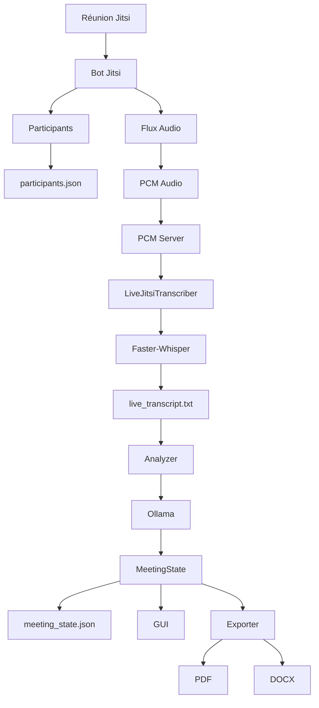

# Pipeline de traitement

## Vue d'ensemble

Le système transforme une réunion Jitsi en compte rendu structuré grâce à une chaîne de traitement composée de plusieurs étapes.



---

# Étape 1 — Initialisation de la réunion

## Objectif

Préparer l'environnement avant le début de la réunion.

### Actions

- Création du contexte de réunion
- Lancement du bot Jitsi
- Initialisation des fichiers
- Réinitialisation de l'état précédent

### Résultat

```text
participants.json = []
live_transcript.txt = ""
meeting_state.json = état vide
```

---

# Étape 2 — Connexion à Jitsi

## Responsable

```text
Jitsi Bot
```

## Actions

- Ouverture du client web local
- Connexion à la salle Jitsi
- Attente du chargement complet de l'API Jitsi

### Sortie

```text
Connexion active à la réunion
```

---

# Étape 3 — Collecte des participants

## Responsable

```text
Jitsi Bot
```

## Source

```javascript
window.jitsiApi._participants
```

## Traitement

Extraction :

```text
Participant ID
Display Name
```

### Résultat

```json
[
  {
    "id": "062bb62f",
    "displayName": "Alice"
  }
]
```

### Fichier produit

```text
participants.json
```

---

# Étape 4 — Capture audio

## Responsable

```text
Client Jitsi
```

## Traitement

Capture des flux audio des participants.

```text
Participant
      │
      ▼
Flux audio WebRTC
```

### Résultat

```text
PCM Audio
```

---

# Étape 5 — Transmission PCM

## Responsable

```text
PCM Server
```

## Adresse

```text
127.0.0.1:8765
```

## Pipeline

```text
Navigateur
      │
      ▼
WebSocket
      │
      ▼
PCM Server
```

### Données

Messages JSON :

```json
{
  "type": "start",
  "participant_id": "062bb62f"
}
```

Puis :

```text
Audio PCM binaire
```

---

# Étape 6 — Transcription

## Responsable

```text
LiveJitsiTranscriber
```

## Moteur

```text
Faster-Whisper
```

## Pipeline

```text
PCM
 │
 ▼
Faster-Whisper
 │
 ▼
Texte
```

### Exemple

```text
Alice: Bonjour à tous.
Bob: Nous devons discuter du projet.
```

### Fichier produit

```text
live_transcript.txt
```

---

# Étape 7 — Analyse de la réunion

## Responsable

```text
Analyzer
```

## Entrée

```text
live_transcript.txt
```

## Traitement

Construction du prompt destiné au LLM.

```text
Transcript
      │
      ▼
Prompt
      │
      ▼
Ollama
```

---

# Étape 8 — Génération du compte rendu

## Responsable

```text
Ollama
```

## Sortie attendue

```json
{
  "summary": "",
  "topics": [],
  "decisions": [],
  "action_items": [],
  "open_questions": []
}
```

### Informations extraites

- Résumé
- Sujets
- Décisions
- Actions
- Questions ouvertes

### Contrainte

Le modèle doit utiliser uniquement les informations présentes dans la transcription.

---

# Étape 9 — Validation

## Responsable

```text
Analyzer
```

## Vérifications

- JSON valide
- Champs obligatoires présents
- Types conformes
- Résumé non nul

### Résultat

```text
MeetingState
```

---

# Étape 10 — Persistance

## Responsable

```text
MeetingController
```

### Sauvegarde

```text
meeting_state.json
```

Exemple :

```json
{
  "summary": "Réunion sur l'avancement du projet.",
  "topics": [
    "Architecture",
    "Tests"
  ]
}
```

---

# Étape 11 — Affichage GUI

## Responsable

```text
GUI
```

### Données affichées

- Participants
- Transcription
- Résumé
- Décisions
- Actions

```text
MeetingState
      │
      ▼
GUI
```

---

# Étape 12 — Export

## Responsable

```text
MeetingExporter
```

## Entrée

```text
MeetingState
```

## Sorties

```text
PDF
DOCX
```

### Pipeline

```text
MeetingState
      │
      ▼
Exporter
      │
 ┌────┴────┐
 ▼         ▼
PDF       DOCX
```

---

# Artefacts produits

| Fichier | Producteur | Utilisateur |
|----------|------------|-------------|
| participants.json | Jitsi Bot | GUI |
| live_transcript.txt | Transcriber | Analyzer |
| meeting_state.json | Analyzer | GUI / Export |
| bot.log | Bot | Développeur |
| PDF | Exporter | Utilisateur |
| DOCX | Exporter | Utilisateur |

---

# Pipeline complet

```text
Réunion Jitsi
      │
      ▼
Participants ──────────────► participants.json
      │
      ▼
Audio
      │
      ▼
PCM
      │
      ▼
PCM Server
      │
      ▼
Faster-Whisper
      │
      ▼
live_transcript.txt
      │
      ▼
Analyzer
      │
      ▼
Ollama
      │
      ▼
MeetingState
      │
      ▼
meeting_state.json
      │
 ┌────┴─────┐
 ▼          ▼
GUI      Exporter
            │
       ┌────┴────┐
       ▼         ▼
      PDF      DOCX
```